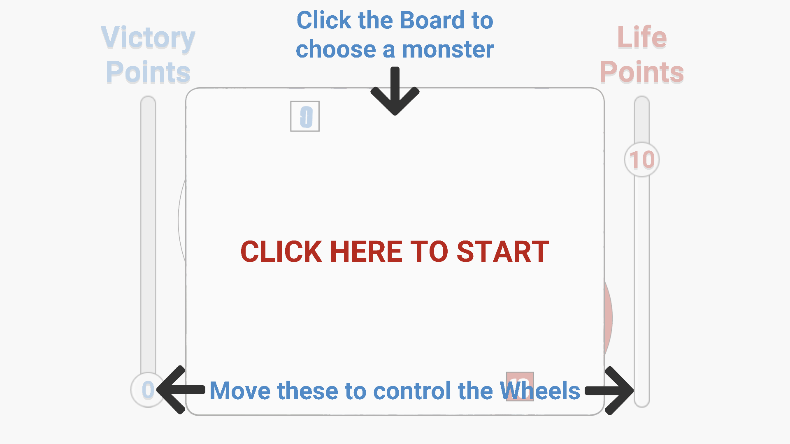
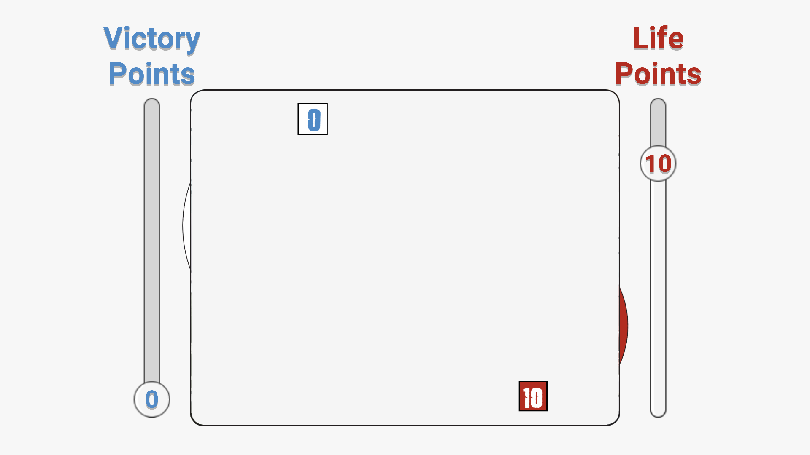
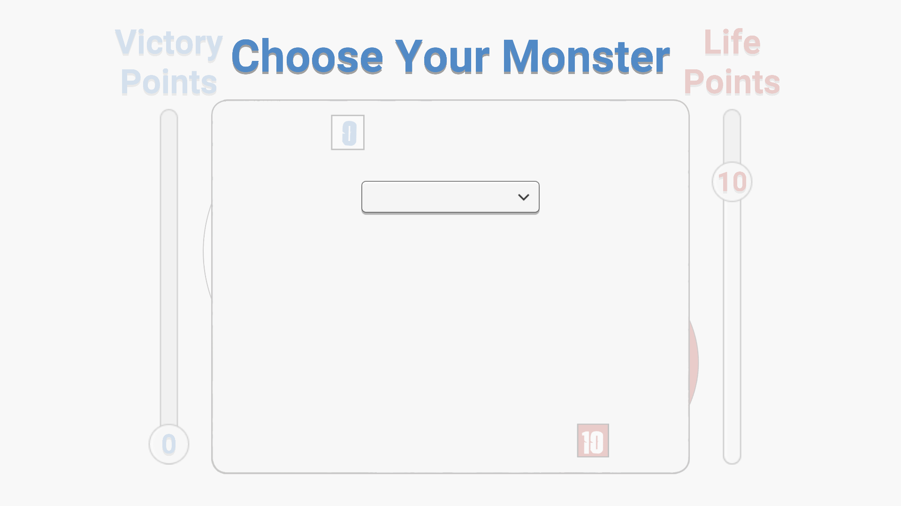
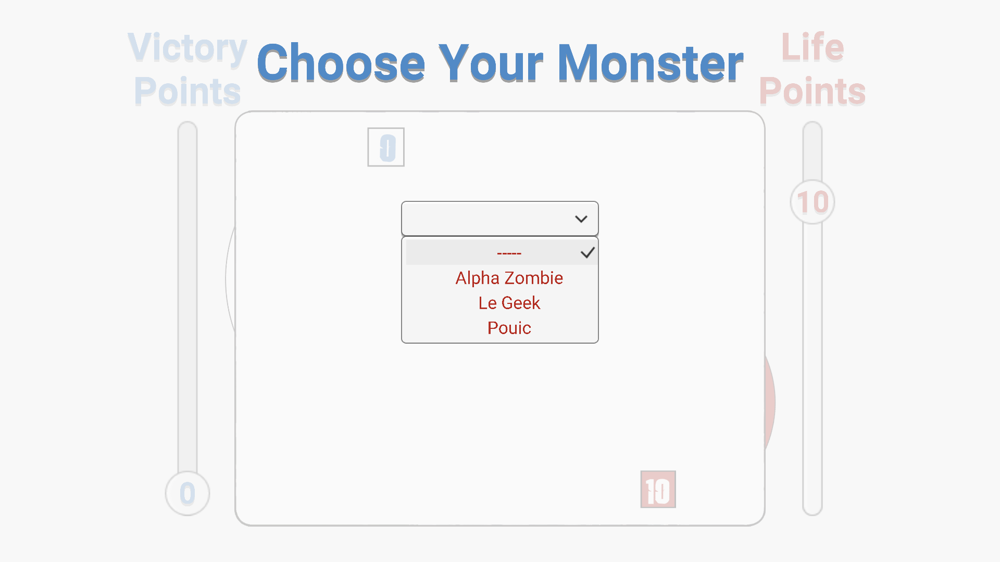
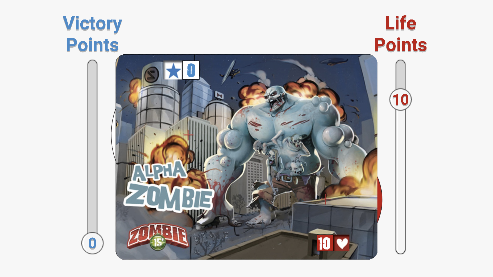
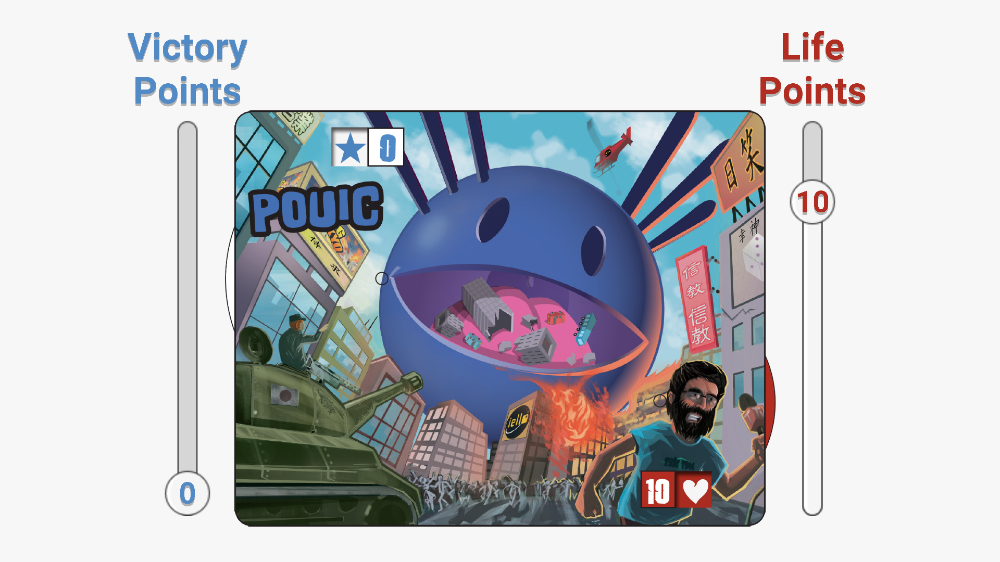
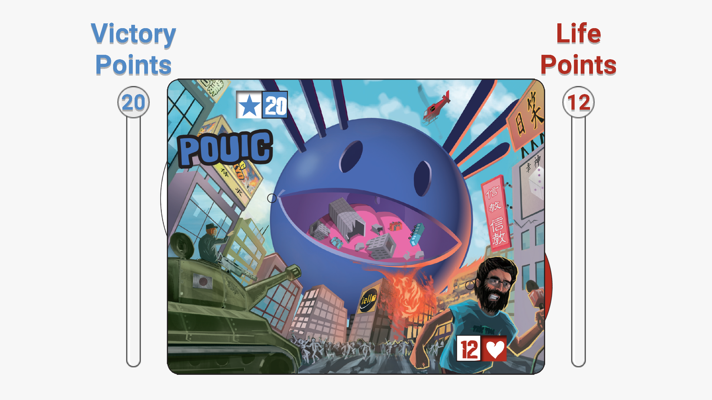
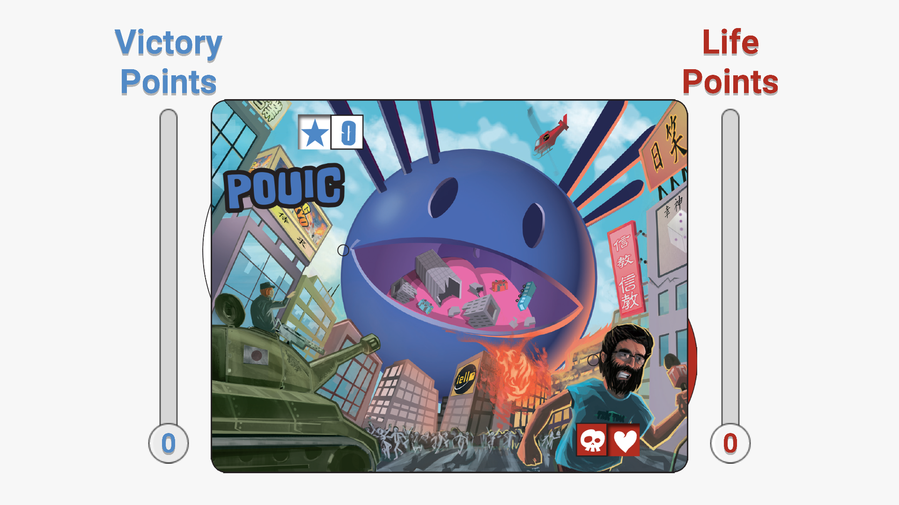

# ScriptableObjects

## Download
1. Download the [Standalone](https://minhaskamal.github.io/DownGit/#/home?url=https://github.com/GameDevPyro/ScriptableObjects/tree/master/Standalone).
2. Unzip the .zip document.
3. Run "Scriptable Objects.exe"

## Standalone Screenshots
### 1. Instructions

### 2. Click on the blank Monster Board

### 3. Open the dropdown

### 4. Choose a Monster
The list is dynamically generated from existing Monsters.

### 5. Example 1 - Alpha Zombie

### 5.1. Example 2 - Le Geek

### 5.2. Example 3 - Pouic

### 6. You can move the Wheels too!
Up to their maximum value (20 VP and 12LP)

... or down until it reaches 0.

